<table>
  <tr>
    <td>
      <h1>Reservoir Computing Using Biologically Grounded Connectome Networks</h1>
    </td>
  </tr>
</table>

<table>
  <tr>
    <td align="center"><a href="https://github.com/tebe-nigrelli"><strong>Tebe Nigrelli</strong></a></td>
    <td align="center"><a href="https://github.com/Kevin-CK3"><strong>Kevin Cesenj Klaric</strong></a></td>
    <td align="center"><a href="https://github.com/christod01"><strong>Christina E. Christodoulou</strong></a></td>
  </tr>
  <tr>
    <td align="center"><a href="https://github.com/giusiscozzi"><strong>Giusi Scozzi</strong></a></td>
    <td align="center"><a href="https://github.com/vgkmn1110"><strong>Vecdi Gokmen</strong></a></td>
    <td align="center"><a href="https://github.com/lorenapavel"><strong>Lorena Pavel</strong></a></td>
  </tr>
  <tr>
    <td align="center"><a href="https://github.com/paranza"><strong>Antonio Perazza</strong></a></td>
    <td align="center"><a href="https://github.com/EmilioVitaliEV"><strong>Emilio Vitali</strong></a></td>
    <td align="center"><a href="https://github.com/a-spahiu"><strong>Angelo Spahiu</strong></a></td>
  </tr>
</table>

  Following the kind direction of Postdoc Researcher <a href="https://scholar.google.com/citations?user=MykmXMQAAAAJ">Victor Buendìa</a>

---

<strong>Abstract</strong>

This project explores the use of reservoir computing to predict chatoic time series, using a biologically grounded reservoir derived from the Human Connectome Project. We first briefly discuss reservoir dynamics and key properties. Then, the topology and structure of the connectome network is studied, and compared to a standard Gaussian network reservoir in the task of predicting the next time step of the Lorenz system. Finally, we evaluate the change in performance of the connectome reservoir following a series of perturbations to better understand how the connectome's structure supports computation and how robust it is to damage.

## Introduction

The brain processes information through networks of neurons connected by synapses. Reservoir computing follows a related principle: a fixed recurrent network, the *reservoir*, transforms an input signal into a rich set of internal states, from which a simple linear readout is trained to make predictions. Since only the readout is trained, the method remains efficient while still modeling complex and chaotic signals.

Here we use structural connectivity data from the Human Connectome Project, which maps connections between brain regions. This lets us replace the usual random reservoir with a biologically grounded network that embeds brain structure directly in the model.

The reservoir is driven by a chaotic input signal and trained to predict the next time step, in our case of the class 63 Lorenz system. We then remove nodes and connections to simulate structural damage and measure how prediction degrades. This tests whether connectome topology supports computation and how robust it is to perturbations.

## Reservoir dynamics

A reservoir can be understood through the analogy of a lake. Raindrops create ripples that spread, interact, and persist before fading; by observing the surface, one can infer something about the rain without seeing each drop. Similarly, an input signal perturbs the network, and that perturbation propagates through the connections and shapes later states. This intuition can be formalized by describing the reservoir as a dynamical system. The state of neuron $i$ at time $t$, denoted by $r_i(t)$, evolves as

$$
\frac{d r_i}{d t} =
-r_i(t) + S\left(
  \sum_{j=1}^{N} W_{ij} r_j(t) + W_i^{\mathrm{in}} u(t)
\right)
$$

The term $-r_i(t)$ represents leaky decay, while the second term captures recurrent input and the external drive after a nonlinear transformation. The current reservoir state is therefore a compressed representation of recent inputs.

In practice, this continuous-time dynamics is simulated by a discrete-time update with a leak rate parameter $\alpha$. Using a forward Euler step with step size $\alpha$ gives

$$
r_i(t + \alpha) =
(1 - \alpha) r_i(t) {}+ \alpha S\left(
  \sum_{j=1}^{N} W_{ij} r_j(t) + W_i^{\mathrm{in}} u(t)
\right)
$$

This matches the implementation in the code: each new reservoir state is a convex combination of the previous state and the current nonlinear activation, with $\alpha$ controlling how fast the state updates. The richness of reservoir dynamics comes directly from its structure: an irregular, highly connected network turns even simple inputs into complex high dimensional activity patterns. Because neurons respond to excitations differently, the network produces a diverse feature set from which the readout can extract information. Reservoir computing works so well because it is generally easier to find patterns in a high-dimensional space rather than in the original input space.

The nature of the dynamics is governed by the recurrent matrix $W$, which determines whether activity decays, persists, or grows. The resulting dynamical regime plays a central role in the reservoir's computational capacity.

To study this behavior in a controlled setting, we first use a Gaussian random reservoir, where the recurrent matrix $W$ is built from independent Gaussian entries sampled as

$$
W_{ij} \sim \mathcal{N}\left(0, \frac{J^2}{N}\right)
$$

where $N$ is the number of neurons and $J$ controls the overall strength of recurrent interactions.

System stability can be understood through the eigenvalues of $W$. For large $N$, Girko's circular law places them approximately within a disc of radius $J$ in the complex plane. The spectral radius, the magnitude of the largest eigenvalue, therefore determines whether perturbations decay or grow. In discrete time, stability requires eigenvalues inside the unit circle; in continuous time, it depends on their real parts.

Thus, three regimes appear which will be studied more in depth in the next section: for $J < 1$, neuron activity decays; for $J \approx 1$, the system is near criticality; and for $J > 1$, the dynamics become unstable or chaotic.

External input enters through the matrix $W^{\mathrm{in}}$. In the state equation, it appears as $\sum_j W^{\mathrm{in}}_{ij} h_j(t)$ and determines how the input affects each neuron before the nonlinearity. This fixed, randomly initialized matrix distributes the input across the reservoir, so the state reflects both internal dynamics and incoming signals.

The goal is to use the reservoir state to predict the next input value, $h(t) \approx h(t + \delta t)$. The model maps $r(t)$ to the output through a linear transformation: $h(t) = W_{\mathrm{readout}} r(t)$, where $W_{\mathrm{readout}}$ contains the readout weights.

The internal and input weights remain fixed; only the readout weights are adjusted during training to approximate the next-step signal, $h(t) \approx h(t + \delta t)$.

The reservoir's internal structure is therefore not trained. Its computational power comes from fixed connections and their induced dynamics rather than from adapting recurrent weights during learning.

### Quantitatative analysis of reservoir dynamics

Building on the framework introduced above, we now investigate how the reservoir dynamics change as the coupling parameter $J$ is varied to get a better understanding of the system's behavior.

<table>
  <tr>
    <td>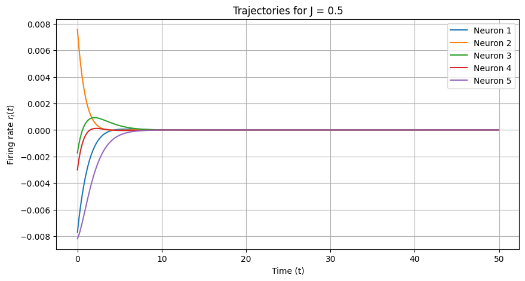</td>
    <td>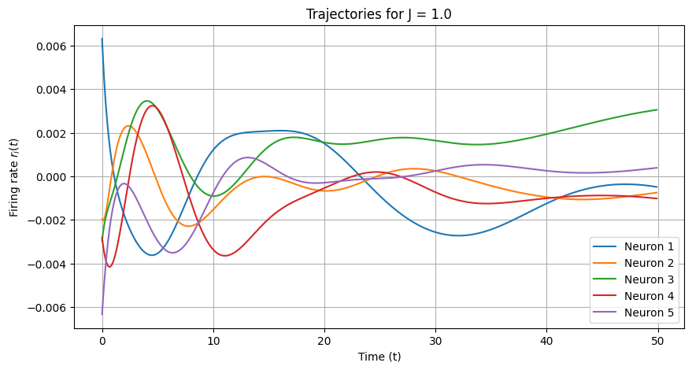</td>
    <td>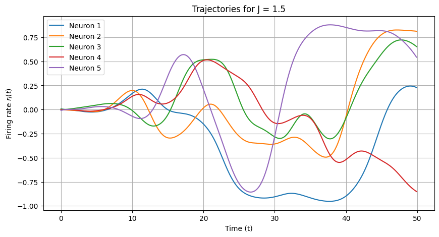</td>
  </tr>
  <tr>
    <td colspan="3" align="center"><em>Figure 1: Neuron trajectories for J &lt; 1, J = 1, and J &gt; 1.</em></td>
  </tr>
</table>

Figure 1 shows representative neuron trajectories for different values of $J$ after a small pertubation for a small Gaussian network. For $J < 1$, trajectories quickly converge to zero, so the system loses dependence on its initial state. Near the critical value ($J \approx 1$), activity decays more slowly and retains information of past inputs for longer. This represents an optimal state for learning, and it is said that the reservoir is exhibitng the Echo State Property. Using the lake analogy, all ripples eventually fade, but stay and interact with new inputs for long enough to create meaninful and rich dynamics which our readout layer can learn to interpete. For $J > 1$, trajectories become irregular and highly variable, indicating a transition to chaos, where small perturbations are amplified over time and the system loses predictability.

To quantify this transition even further, we measure temporal variability. Networks of $N = 400$ neurons are simulated for $T = 50$ time units with step size $d t = 0.1$. For each $J$, the variance of each neuron's activity is computed over time and averaged across neurons and $10$ fixed-seed realizations.

The results are shown in Fig. 2. For small $J$, the mean temporal variance stays near zero, confirming rapid convergence. Beyond the critical regime, the variance rises sharply, reflecting sustained fluctuations.

  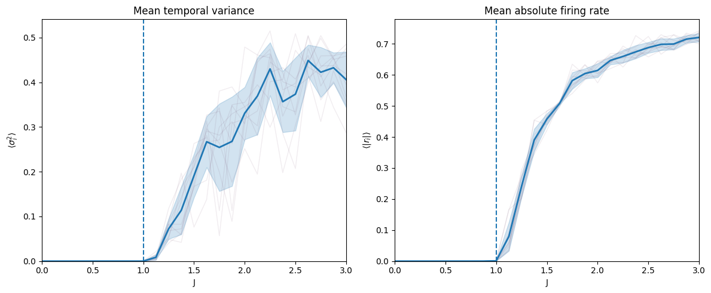
   
  <em>Figure 2: Mean temporal variance vs. J (10 trials, seed 42).</em>

These regimes directly affect reservoir memory. In the stable regime ($J < 1$), the system quickly forgets past inputs as trajectories collapse to a fixed point. Near criticality ($J \approx 1$), slower decay improves memory. For $J > 1$, sensitivity to perturbations breaks consistent behavior and violates the Echo State Property.

The same transition appears at the population level. In Fig. 3, activation distributions broaden as $J$ increases, shifting from a narrow concentration around zero to a wide, heterogeneous spread.

  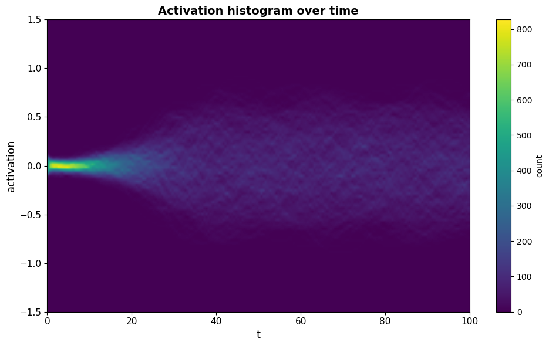
   
  <em>Figure 3: Activation histograms over time (N = 500, T = 100, dt = 0.1).</em>

## Human connectome data and network analysis

We now turn to the human connectome data and examine how its graph structure can serve as a biologically grounded reservoir.

The dataset comes from a preprocessed Human Connectome Project release in which each subject is stored as a `.graphml` file representing brain structural connectivity.

Each file records brain regions and the connections between them. Nodes correspond to regions, while edges represent structural connections such as white matter fiber tracts.

Graph-theoretically, the connectome is modeled as $G = (V, E)$, where $V$ is the node set and $E$ the edge set. The graph is undirected, so the connectivity matrix is symmetric: $W_{ij} = W_{ji}$.

The analyzed graph has $463$ nodes, determined by a brain parcellation that balances anatomical detail with computational cost. This resolution remains manageable while preserving meaningful connectivity structure.

A relatively large node count also makes network statistics clearer. In smaller graphs, finite-size fluctuations can obscure the underlying structure.

Each node includes its 3D position, hemisphere, and anatomical label. Edges describe regional connections and include mean fiber length, fractional anisotropy (FA), and number of fibers.

We separate the graph into node- and edge-level information to analyze both spatial organization and connection structure.

At the node level, positions show a clear 3D brain organization, seen in Figure 4. The distribution is roughly symmetric, with visible separation between hemispheres; most regions form a compact structure, while boundary nodes are more spread out. This confirms that the graph preserves anatomical layout.

  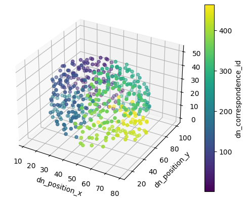
   
  <em>Figure 4: Connectome nodes in 3D, colored by hemisphere.</em>

At the edge level, connection features are strongly heterogeneous. The number of fibers ranges from about $1$ to more than $4600$, with median around $22$, so most connections are weak. The distribution is strongly right-skewed, with many low values and a long tail of high-weight edges.

The high skewness ($\approx 6.37$) and large kurtosis ($\approx 63$) support this heavy-tailed interpretation.

Fiber length spans a wider range, roughly $10$ to $100$, and decays more smoothly, with moderate skewness.

The FA distribution is more concentrated and decreases rapidly as values increase. Visually it resembles an exponential-like decay, though a formal test would be needed to confirm this. These reuslts are shown in Figure 5, which plots histograms and pairwise densities of the three edge features.

Overall, the connectome is heterogeneous rather than uniform, with a small subset of connections carrying much larger weights.

  
   
  <em>Figure 5: Edge-feature histograms and pairwise densities.</em>

We further examine the edge features through correlation analysis, shown in Figure 6. Most relationships are weak. The clearest pattern is a moderate negative correlation between fiber length and number of fibers ($\rho \approx -0.37$), suggesting that longer connections tend to involve fewer fibers.

Correlations involving FA are much weaker ($\rho \approx 0.08$ with fiber length and $\rho \approx 0.04$ with number of fibers), suggesting that FA captures a different aspect of connectivity.

We use Spearman's rank correlation rather than Pearson correlation because the edge features, especially fiber count, are strongly skewed. Rank correlation is less dominated by extreme values and is therefore more robust here.

  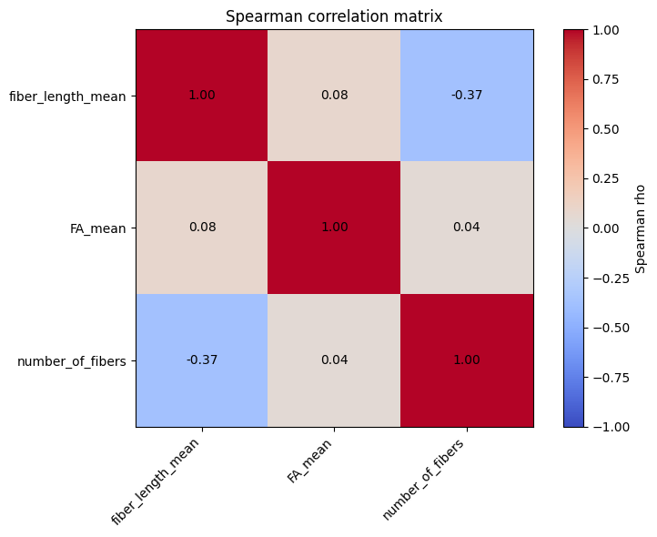
   
  <em>Figure 6: Spearman correlations between structural edge features.</em>

Finally, the network shows non-trivial *community structure*: groups of nodes are more strongly connected internally than with the rest of the graph. This supports the view of the connectome as a structured, not random, network.

## Training the reservoir

### Lorenz system overview

Before delving into the training process of the reservoir, we first introduce the chaotic system used to test our reservoir, chosen for its simplicity and rich nonlinear dynamics.

The Lorenz system is a set of three coupled ordinary differential equations developed by Edward Lorenz while studying atmospheric convection. It is a classic example of deterministic chaos: the equations contain no randomness, yet they are highly sensitive to initial conditions and can display aperiodic behavior.

$$
\begin{cases}
\dfrac{d x}{d t} = \sigma (y - x), \\
\dfrac{d y}{d t} = x (\rho - z) - y, \\
\dfrac{d z}{d t} = x y - \beta z
\end{cases}
$$

The parameters $\rho$, $\sigma$, and $\beta$ are constants, while $x(t)$, $y(t)$, and $z(t)$ are time-dependent state variables. Sensitivity to initial conditions makes long-term prediction infeasible. Although the system is deterministic, small numerical errors are amplified exponentially, so trajectories eventually diverge from the true continuation. Another key property is boundedness. Although trajectories are chaotic and sensitive, they do not diverge to infinity; instead, they remain confined to the butterfly-shaped Lorenz attractor, shown in Fig. 7.

  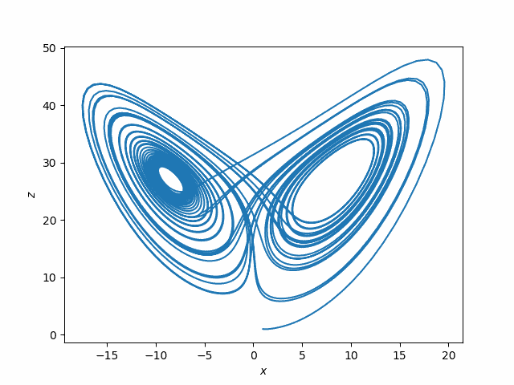
   
  <em>Figure 7: Lorenz attractor trajectory.</em>

This makes the system useful for reservoir computing: beyond short-term accuracy, it tests whether the model learns the qualitative attractor geometry. A good autonomous model should remain bounded even after exact phase alignment is lost. We generate the Lorenz attractor by numerical integration with the Euler method, chosen for speed. For our experiments, we will select the classical Lorenz-63 parameters, which place the system in a chaotic but bounded regime.

### Training process

We now outline the implementation strategy. The project has two phases. First, we built and validated the predictive pipeline with standard Gaussian random networks. After confirming that the baseline could model the Lorenz attractor in a controlled setting, we replaced the random Gaussian networks with empirical human connectome data to test the same task on a brain-derived topology.

As discusssed before, in reservoir computing the internal network is fixed. Training therefore consists of driving the reservoir with data, recording the resulting states, and fitting only the linear readout.

We collect these states using *teacher forcing*: during training, the reservoir is driven by the true Lorenz signal rather than by its own predictions. At each time step, all neuron activations are stored in a state matrix $R$. The first $200$ time steps are discarded as washout, because they mostly reflect the transient caused by zero-state initialization. After this removal, $R$ contains reservoir activity synchronized with the Lorenz dynamics.

Once $R$ is collected, each reservoir state at time $t$ is paired with the true Lorenz state at time $t+1$. These next-step targets form $H_{\mathrm{target}}$, and the readout weights $W_{\mathrm{readout}}$ are fitted by ridge regression:

$$
W_{\mathrm{readout}} = \operatorname*{arg\,min}_{W}
\left\lVert W R - H_{\mathrm{target}} \right\rVert^2
{}+ \lambda \left\lVert W \right\rVert^2
$$

where $\lambda$ penalizes large weights and helps prevent overfitting to noise or small fluctuations in the training data.

We also augment $R$ with a constant bias row of ones. This gives the readout an intercept term, allowing it to learn constant offsets in the output coordinates instead of forcing every prediction to pass through the origin.

## Experimental results

In the final stage of the project, we compared the different reservoir variants on the same Lorenz prediction task. In each case, the reservoir was first driven by the true Lorenz signal using teacher forcing. After training the linear readout, the model was then run autonomously, meaning that its own predicted output was fed back as the next input. For all models, $t_{\mathrm{thermalization}} = 50.0$, $t_{\mathrm{training}} = 2000.0$, and $t_{\mathrm{prediction}} = 10.0$.

Because the Lorenz system is chaotic, exact trajectory matching is not expected over long horizons, but we hope for short term accurate predicitons and a feasible attractor geometry even after divergence. Divergence time is used to quantify short-term prediction accuracy. It is defined as the time at which the Euclidean distance between the predicted and true Lorenz states exceeds a threshold $\epsilon = 4.0$. This threshold was chosen to be large enough to avoid false positives from small fluctuations, but small enough to detect when the model has lost track of the true trajectory.

### Gaussian reservoir baseline

The Gaussian reservoir was used as a reference model because its recurrent matrix is dense and randomly generated, rather than based on brain connectivity. In our baseline run, the reservoir used $N = 300$ neurons, target spectral radius $J = 0.9$, input scaling $0.3$, ridge parameter $\lambda = 3 \times 10^{-3}$, and a leak parameter $\alpha = 0.1$. These parameters were chosen as they seemd to result in the longest prediction window.

<table>
  <tr>
    <td>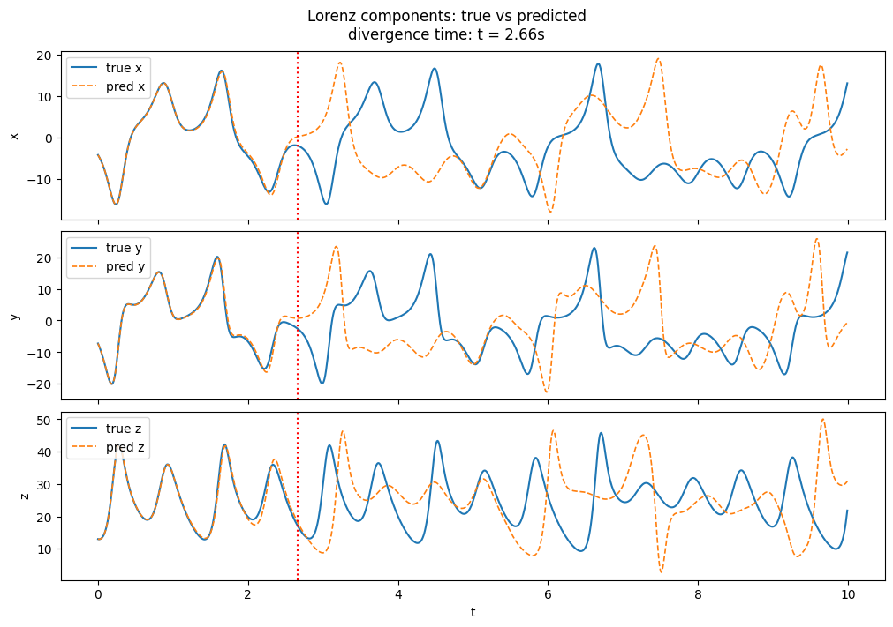</td>
    <td>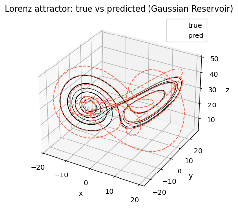</td>
  </tr>
  <tr>
    <td colspan="2" align="center"><em>Figure 8: Gaussian reservoir prediction: components and 3D attractor.</em></td>
  </tr>
</table>

As seen in figure 8, the Gaussian reservoir initially tracks the Lorenz signal well, with a divergence time of about 2.66s. Even after divergece, the 3D attractor shows that the model remains bounded and roughly resembles the Lorenz attractor, but it does not reproduce the exact lobe-switching behavior.

This step shows that the basic reservoir computing pipeline is working as intended. The model can learn to predict the next step of a chaotic signal and produce bounded dynamics that resemble the true attractor, even though exact trajectory matching is lost after a short time.

### Human-connectome reservoir

We now replace the Gaussian recurrent matrix with the weighted adjacency matrix of a human structural connectome. This gives the reservoir an anatomical topology while keeping the same basic learning procedure: the internal weights are fixed, and only the linear readout is trained. The experiment used $J = 0.9$, input scaling $0.3$, ridge parameter $\lambda = 3 \times 10^{-3}$, and a leak parameter $\alpha = 0.3$. Again these parameters seem to give the longest prediction window, though we did not perform a systematic hyperparameter sweep.

<table>
  <tr>
    <td>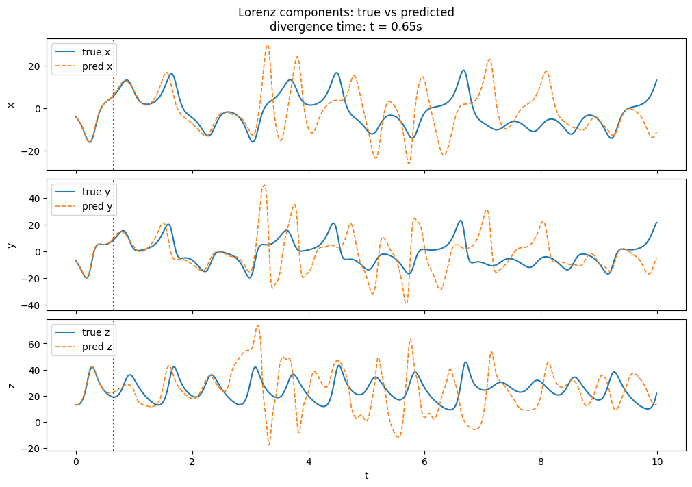</td>
    <td>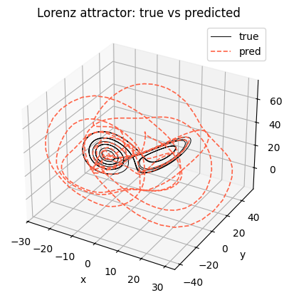</td>
  </tr>
  <tr>
    <td colspan="2" align="center"><em>Figure 9: Connectome reservoir prediction: components and 3D attractor.</em></td>
  </tr>
</table>

Once again, from figure 9 we can see that the model initially tracks the true Lorenz signal, but diverges after a time of just 0.65s. The 3D trajectory remains bounded, but the model does not reproduce the exact butterfly like shape of the attractor. Comparing these results to the Gaussian baseline, the connectome reservoir seems to produce less accurate short-term predictions and a less faithful attractor geometry.

  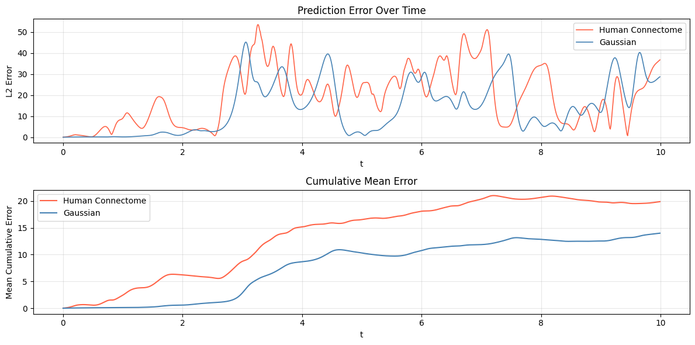
   
  <em>Figure 10: Prediction error over time and cumulitive error for Gaussian vs. connectome reservoir.</em>

The comparison is made more clear in Figure 10, which shows that the cumulative error grows faster and always stays larger for the connectome reservoir. This suggests that the anatomical structure alone does not provide a better reservoir for this task, at least with the tested hyperparameters. The connectome's fixed topology may limit its ability to capture the complex dynamics of the Lorenz system compared to a random reservoir that can more easily produce rich internal representations.

Still, the connectome reservoir does produce bounded dynamics and a short term accurte prediciton window, so it does function as a reservoir, which could potentially be optimzised for better perfomance with more systematic hyperparameter tuning or by using a different connectome subject. Therfore we still move on to the perturbation experiments to see how the connectome reservoir behaves under structural damage.

### Perturbation experiments

To test robustness, we applied four types of perturbations to the connectome reservoir: node deletion, edge deletion, edge swapping, and node-label swapping. For each perturbation experiment, $p$ was varied from $0$ to $0.99$, where $p$ represents the fraction of nodes or edges affected. For each $p$, the network is perturbed, trained and evaluated on the same Lorenz prediction task, and the average divergence time across 10 fixed-seed runs is recorded. Then we repeat this for 100 other connectome networks and take the expecation over all the divergence times. The results are shown in figure 11.

  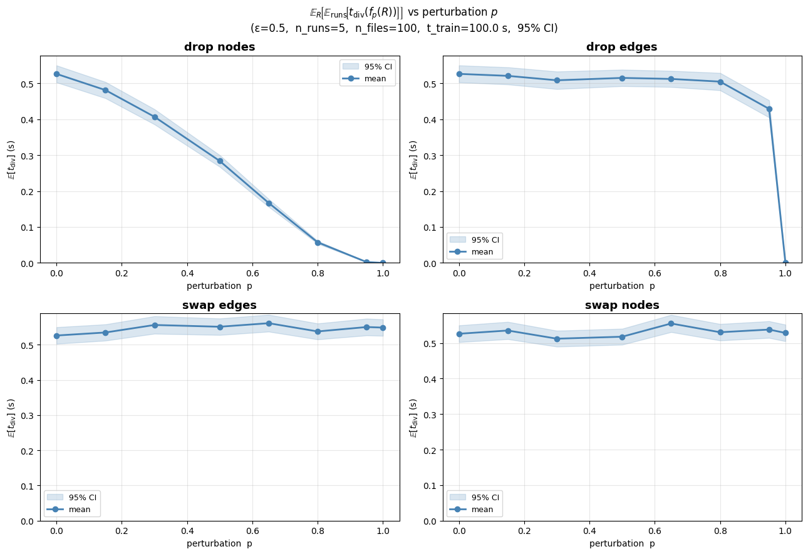
   
  <em>Figure 11: Divergence time under four connectome perturbations.</em>

It is clear that node deletion has the strongest effect. As $p$ increases, the average divergence time drops sharply and approaches zero when most nodes are removed. This is expected because deleting nodes reduces the dimension of the reservoir and therofre the richness of the nonlinear dymaics. With fewer internal variables, the readout has less information available to reconstruct the Lorenz state.

Edge deletion has a weaker effect over most of the tested range and becomes clearly damaging only at very high deletion levels. This points to redundancy in the graph: many individual connections can be removed while enough recurrent structure remains for short-term prediction. There is also an implementation effect to consider. After perturbation, each graph is rescaled by its spectral radius, so the overall recurrent gain remains comparable across perturbation levels. This normalization probably reduces the apparent impact of deleting edges.

Edge swapping produces little visible change in the plotted range. For this task, preserving the number of nodes and the global recurrent strength seems more important than preserving the exact anatomical placement of every edge. Node-label swapping also has little effect because it mainly changes the ordering or labels of nodes while leaving the underlying graph structure almost unchanged. This suggests that the reservoir's computational capacity depends more on global properties like node count and overall connectivity rather than on specific edge arrangements, which implies that the actual topology of the connectome is not critical for this taks, and offers no clear advantage.

## Conclusion

Overall, the experiments show that both Gaussian and connectome-based reservoirs can produce bounded Lorenz-like trajectories, but neither gives reliable long-horizon prediction with the tested hyperparameters. This is consistent with the chaotic nature of the Lorenz system. Once the model is run autonomously, small readout errors are repeatedly fed back into the reservoir and are quickly amplified.

The connectome result is still interesting because it shows that a fixed anatomical graph can function as a reservoir and generate nontrivial dynamics without training its internal weights. However, the task also makes clear that biological structure alone does not guarantee accurate prediction of an artificial chaotic signal, worse yet, it seems to underperform the standard Gaussian reservoir with similar hyperparameters. This suggests that the connectome's fixed topology may limit its ability to capture the complex dynamics of the Lorenz system compared to a random reservoir that can more easily produce rich internal representations.

The perturbation experiments give the clearest conclusion. Removing nodes is much more harmful than removing or rewiring edges because it directly reduces the number of reservoir states available to the readout. Edge deletion and edge swapping have weaker effects, suggesting the reservoirs internal structure is not optimized for these kind of predicitons.

This does not imply that the brain is not optimized for computation, more likely our training task is not an accurate representation of how the brain actually works, and is too surface level to actually discover any biologically advantageous properties of the brains anatomical structure.

A further study would perform a more detailed hypermaparemter sweep, and potentaily test different connectome reservoirs on different classes of lorentz systems to see if any of them are better suited to the task. The perturbation experiments could also be performed after the training phase, to see how the trained readout weights are affected by structural damage, which would be more biologically relevant. Finally, a more detailed analysis of the connectome's graph structure could reveal whether certain motifs or subgraphs are particularly important for reservoir computation.
